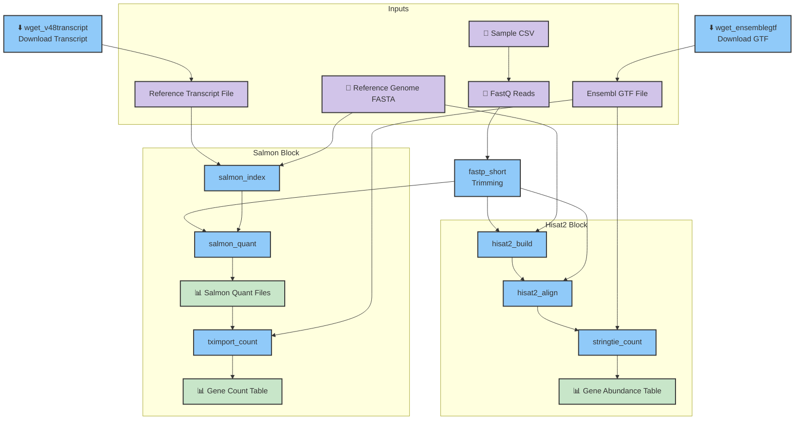

# nextflow-rnaseq
RNA-seq nextflow pipeline for gene and transcript counting using either alignment or pseudoalignment

# Workflow Diagram


# How to Run the Workflow

1. **Install Nextflow** (if not already installed):
   ```sh
   curl -s https://get.nextflow.io | bash
   mv nextflow ~/bin/
   # Or follow instructions at https://www.nextflow.io/
   ```

2. **Prepare your input files**
   - Place your sample CSV, reference genome, GTF, and transcript files in the appropriate locations as described in the workflow diagram. For now you can use those in /data/ and the path to these files are currently included in the workflow/main.nf params

3. **Run the workflow**
   ```sh
   cd nextflow-rnaseq/workflow
   nextflow run main.nf -profile mamba
   ```

4. **View results**
   - Output files will be generated in the `result/` directory.

