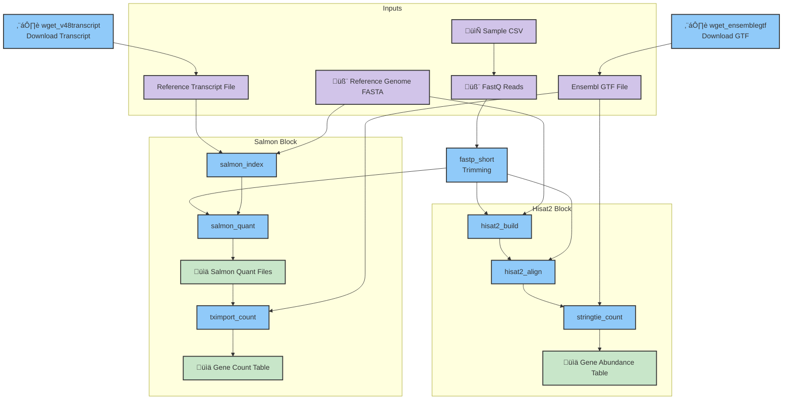

# nextflow-rnaseq
RNA-seq nextflow pipeline for gene and transcript counting using either alignment or pseudoalignment

# Workflow Diagram

```mermaid
flowchart TD
    %% Downloads (blue, top)
    H[⬇️ wget_ensemblegtf<br>Download GTF] --> O[Ensembl GTF File]
    I[⬇️ wget_v48transcript<br>Download Transcript] --> N[Reference Transcript File]

    %% Input files (purple, below downloads)
    A[📄 Sample CSV] --> R[🧬 FastQ Reads]
    F[🧬 Reference Genome FASTA]

    %% Preprocessing
    R --> B[fastp_short<br>Trimming]

    %% Hisat2 Block (left)
    B --> C1[hisat2_build]
    F --> C1
    C1 --> C2[hisat2_align]
    B --> C2
    C2 --> D1[stringtie_count]
    O --> D1
    D1 --> L[üìä Gene Abundance Table]

    %% Salmon Block (right)
    B --> J2[salmon_quant]
    N --> J1[salmon_index]
    F --> J1
    J1 --> J2
    J2 --> M[üìä Salmon Quant Files]
    M --> K1[tximport_count]
    O --> K1
    K1 --> K[üìä Gene Count Table]

    %% Grouping for visual clarity
    subgraph Inputs [Inputs]
        A
        R
        F
        O
        N
    end

    subgraph Hisat2_Block [Hisat2 Block]
        C1
        C2
        D1
        L
    end

    subgraph Salmon_Block [Salmon Block]
        J1
        J2
        M
        K1
        K
    end

    %% Consistent coloring
    style A fill:#d1c4e9,stroke:#333,stroke-width:2px
    style R fill:#d1c4e9,stroke:#333,stroke-width:2px
    style F fill:#d1c4e9,stroke:#333,stroke-width:2px
    style O fill:#d1c4e9,stroke:#333,stroke-width:2px
    style N fill:#d1c4e9,stroke:#333,stroke-width:2px

    style B fill:#90caf9,stroke:#333,stroke-width:2px
    style C1 fill:#90caf9,stroke:#333,stroke-width:2px
    style C2 fill:#90caf9,stroke:#333,stroke-width:2px
    style D1 fill:#90caf9,stroke:#333,stroke-width:2px
    style J1 fill:#90caf9,stroke:#333,stroke-width:2px
    style J2 fill:#90caf9,stroke:#333,stroke-width:2px
    style K1 fill:#90caf9,stroke:#333,stroke-width:2px
    style H fill:#90caf9,stroke:#333,stroke-width:2px
    style I fill:#90caf9,stroke:#333,stroke-width:2px

    style M fill:#c8e6c9,stroke:#333,stroke-width:2px
    style K fill:#c8e6c9,stroke:#333,stroke-width:2px
    style L fill:#c8e6c9,stroke:#333,stroke-width:2px
```
